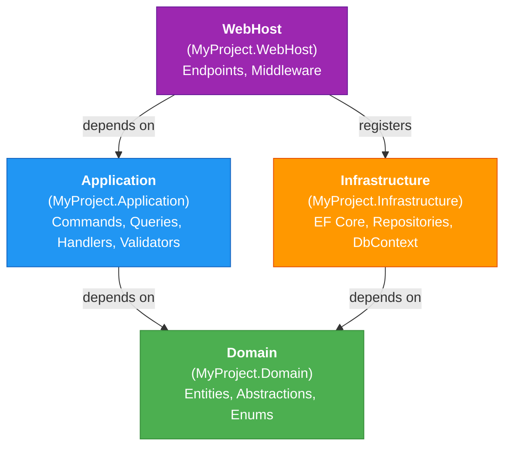

```mermaid
graph TD
    WebHost["<b>WebHost</b><br/>(MyProject.WebHost)<br/>Endpoints, Middleware"]
    APP["<b>Application</b><br/>(MyProject.Application)<br/>Commands, Queries, Handlers, Validators"]
    INF["<b>Infrastructure</b><br/>(MyProject.Infrastructure)<br/>EF Core, Repositories, DbContext"]
    DOM["<b>Domain</b><br/>(MyProject.Domain)<br/>Entities, Abstractions, Enums"]

    WebHost -->|depends on| APP
    WebHost -->|registers| INF
    APP -->|depends on| DOM
    INF -->|depends on| DOM

    style DOM fill:#4CAF50,color:#fff,stroke:#388E3C
    style APP fill:#2196F3,color:#fff,stroke:#1565C0
    style INF fill:#FF9800,color:#fff,stroke:#E65100
    style WebHost fill:#9C27B0,color:#fff,stroke:#6A1B9A
```
