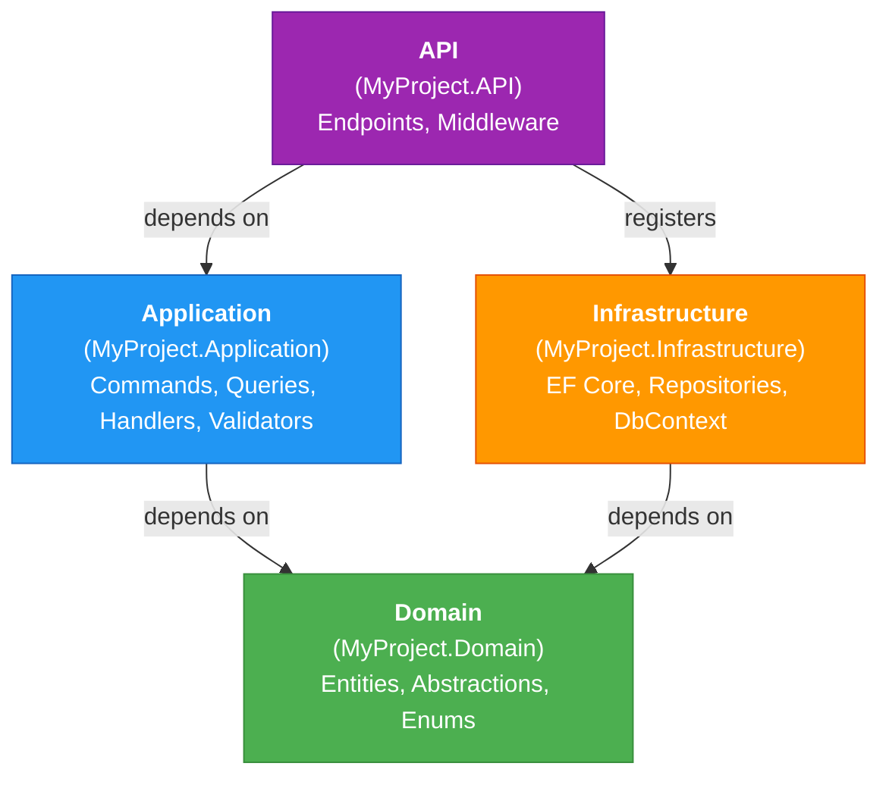

# Commands

```bash
# Build
dotnet build

# Run API (target .NET 10)
dotnet run --project src/MyProject.API/MyProject.API.csproj

# Run all tests
dotnet test

# Run a single test project
dotnet test tests/MyProject.Application.UnitTests/

# Run a specific test
dotnet test --filter "FullyQualifiedName~SomeTestName"
```

No solution file — this is a modern .NET 10 project using directory-level build props.

# Architecture

Clean Architecture with 4 layers (strict unidirectional dependency: API → Application → Domain; Infrastructure → Domain):




```
src/
├── {ProjectName}.Domain/
│   ├── Abstractions/          ← IRepository<T>, IUnitOfWork, IUserContext, IDateTimeProvider, Result<T>, Error
│   ├── Entities/              ← Order, Customer, Product (with behavior methods)
│   ├── Enums/                 ← OrderStatus, PaymentMethod
│   └── Repositories/          ← IOrderRepository, IProductRepository (entity-specific interfaces)
│
├── {ProjectName}.Application/
│   ├── Abstractions/
│   │   ├── Data/              ← ISqlConnectionFactory
│   │   ├── Messaging/         ← ICommand, IQuery, ICommandHandler, IQueryHandler
│   │   └── {Feature}/         ← feature-specific interfaces (e.g., Authentication/IJwtTokenService)
│   ├── Behaviors/             ← ValidationBehavior
│   ├── Exceptions/            ← ValidationException, ValidationError
│   ├── Shared/                ← Common
│   │   └── Dtos/              ← Reusable DTOs shared across operations in this project
│   │   └── RuleValidator/     ← Reusable validators shared across operations in this project
│   └── Features/
│       └── {EntityPlural}/        ← Feature folder per aggregatee.g., Users/, Orders/, Products/
│           ├── Shared/            ← Reusable validators shared across operations in this group
│           └── {OperationName}/   ← e.g., Register/
│               ├── {OperationName}Command.cs             ← or {OperationName}Query.cs
│               ├── {OperationName}CommandHandler.cs      ← or {OperationName}QueryHandler.cs
│               ├── {OperationName}CommandValidator.cs    ← Commands only
│               ├── {OperationName}Response.cs            ← if operation returns a DTO — always its own file, same directory as handler
│               └── README.md                             ← Business documentation
│
├── {ProjectName}.Infrastructure/
│   ├── Data/
│   │   ├── AppDbContext.cs
│   │   └── Configurations/    ← OrderConfiguration : IEntityTypeConfiguration<Order>
│   └── Repositories/          ← OrderRepository : IOrderRepository
│
└── {ProjectName}.API/
    ├── Endpoints/             ← CreateOrderEndpoint, GetOrderEndpoint, IEndpoint, EndpointExtensions
    └── Extensions/            ← GlobalExceptionHandler, CorrelationIdMiddleware, SerilogExtensions
```

# Key Patterns

**Endpoint registration** — Implement `IEndpoint`, place in `src/MyProject.API/Endpoints/`. The endpoint is picked up automatically; no manual registration needed.

**Commands/Queries** — Add a MediatR `IRequest<Result<T>>` + handler in `src/MyProject.Application/Features/{Feature}/`. Add a FluentValidation `AbstractValidator<TRequest>` in the same folder; the pipeline runs it automatically.

**Result pattern** — Domain errors use `Result<T>` (not exceptions). Use `Result.Success(value)` / `Result.Failure(error)` and check `result.IsFailure` in handlers or endpoints.

**Audit trail** — All entities extending `BaseEntity` automatically get `CreatedAt`, `CreatedBy`, `UpdatedAt`, `UpdatedBy` set by `AppDbContext.SaveChangesAsync`. `IsDeleted` enables soft deletes.

**EF Core config** — Entity configurations go in `src/MyProject.Infrastructure/Data/Configurations/` using Fluent API with snake_case naming convention.

# Testing

| Project | Scope | Key Dependencies |
|---|---|---|
| `Domain.UnitTests` | Entity logic | xunit, FluentAssertions |
| `Application.UnitTests` | Handlers, validators, behaviors | + NSubstitute |
| `Infrastructure.IntegrationTests` | Repositories, EF Core config | + Testcontainers (PostgreSQL), Respawn |
| `API.IntegrationTests` | End-to-end HTTP | + WebApplicationFactory, Testcontainers, Respawn |
| `ArchitectureTests` | Layer dependency enforcement | NetArchTest.Rules |

Integration tests spin up a real PostgreSQL container via Testcontainers. Respawn resets data between tests.

# Package Management

All NuGet versions are centrally managed in `Directory.Packages.props`. Do not set `Version` on `<PackageReference>` in individual project files; use `VersionOverride` only when necessary.

# Code Style

- Nullable reference types enabled
- Async all the way - no .Result or .Wait()
- Record types for DTOs
- Always IOptions<T> or IOption no raw config["Key]
- NEVER use DateTime.Now - use IDateTimeProvider